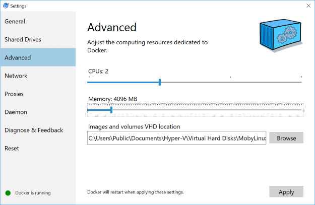

# stack-docker
This example Docker Compose configuration demonstrates many components of the
Elastic Stack, all running on a single machine under Docker.

## Prerequisites
- Docker and Docker Compose.

  * You can read the [install instructions](https://docs.docker.com/compose/install/#install-compose) or can install via pip:
```
pip install docker-compose
```



* Adjust mermory for docker image:

```
sysctl -w vm.max_map_count=262144
```
By default, the amount of Virtual Memory [is not enough](https://www.elastic.co/guide/en/elasticsearch/reference/current/vm-max-map-count.html).


## Starting the stack

First we need to:

1. set default password
2. create keystores to store passwords
3. install dashboards, index patterns, etc.. for beats and apm

This is accomplished using the setup.yml file:
```
docker-compose -f setup.yml up
```

Please take note after the setup completes it will output the password
that is used for the `elastic` login.

Now we can launch the stack with `docker-compose up -d` to create a demonstration Elastic Stack with
Elasticsearch, Kibana, Logstash, Auditbeat, Metricbeat, Filebeat, Packetbeat,
and Heartbeat.

Point a browser at [`http://localhost:5601`](http://localhost:5601) to see the results.
> *NOTE*: Elasticsearch is now setup with self-signed certs.

Log in with `elastic` and what ever your auto generated elastic password is from the
setup.
